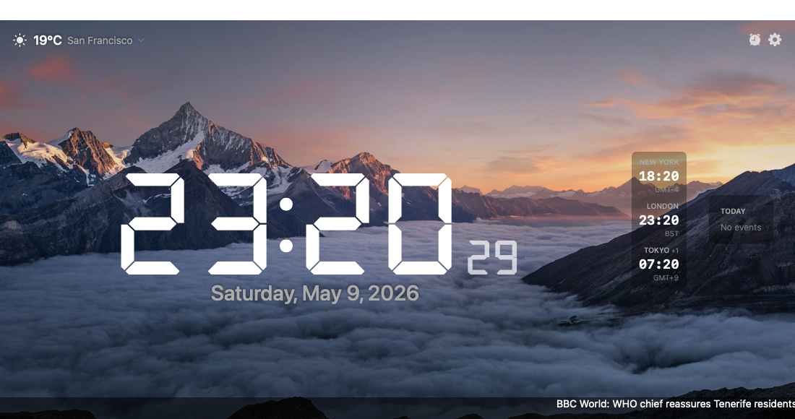

# MacClock

A native macOS desktop clock that turns your screen into a glanceable home display.



Digital, analog, and split-flap clock styles. Live weather. Calendar countdown and agenda. Alarms with timezone-aware scheduling. World clocks. RSS news ticker. Rotating Unsplash nature backgrounds. Built with SwiftUI, no third-party dependencies.

## Features

- **Three clock styles** — digital LCD (DSEG7 font), analog with hour/minute/second hands, split-flap "flip clock"
- **Live weather** — current conditions, hourly forecast, daily highs/lows, sunrise/sunset (via [Open-Meteo](https://open-meteo.com/), no API key)
- **Calendar** — countdown to your next event plus today's agenda. Pulls from macOS Calendar (native) and any number of iCal/ICS feed URLs (Google, Outlook, work calendars)
- **Alarms** — recurring days, snooze with limits, custom output device for the alarm sound
- **World clocks** — side panel or bottom bar; ships with New York, London, Tokyo, fully customisable
- **News ticker** — scrolling or rotating headlines from any RSS/Atom feed; ships with major outlets pre-configured
- **Backgrounds** — random nature photos (Unsplash), time-of-day gradients tied to local sunrise/sunset, or your own image
- **Themes** — six built-in colour themes (Classic White, Warm Amber, Matrix Green, Cool Blue, Rose Gold, Pure Mono); auto-switching day/night theme; auto-dim on schedule, sunrise/sunset, or system appearance
- **Window control** — normal / floating-on-top / pinned-to-desktop modes; configurable opacity; remembers position and size
- **Dynamic dock icon** — the dock icon shows the current time
- **Accessibility** — VoiceOver labels on every interactive element

## Requirements

- macOS 14 (Sonoma) or later
- Apple Silicon or Intel
- Swift 5.9+ (for building from source — bundled with Xcode 15+)
- Optional: [XcodeGen](https://github.com/yonaskolb/XcodeGen) (`brew install xcodegen`) if you want to run the XCUITest suite

## Install

### Pre-built DMG (recommended)

Download the latest `MacClock.dmg` from the [Releases page](https://github.com/Tapnetix/MacClock/releases/latest). Mount the DMG, then:

- **Easy path:** Double-click **`Install MacClock.command`** inside the DMG. It copies the app to `/Applications`, removes the macOS quarantine flag, and launches the app. macOS will show a one-time security prompt the first time you run the script — click **Open** / **Allow**.
- **Manual path:** Drag `MacClock.app` to the `Applications` shortcut, then run `xattr -cr /Applications/MacClock.app` in Terminal to clear the quarantine flag, then double-click MacClock.

The quarantine step is necessary because the build is *ad-hoc signed* (no paid Apple Developer ID for notarisation). macOS Gatekeeper blocks ad-hoc apps from quarantined downloads — the `xattr -cr` removes that flag. It's a one-time step per install.

### Build from source

```bash
git clone https://github.com/Tapnetix/MacClock.git
cd MacClock
./build-app.sh
open MacClock.app
```

`./build-app.sh` produces `MacClock.app` in the repo root. Locally-built apps don't get quarantined and launch directly.

### Run from Swift PM (developer mode)

```bash
swift run
```

## First-run

The app opens with sensible defaults: nature-photo background rotating every 10 minutes, large 24-hour digital clock, three world clocks, news ticker pulling built-in feeds, and weather auto-located. Open Settings (⌘,) or the gear icon to customise.

The first launch will prompt for:

- **Location** — only if you keep auto-location on. Used for weather and sunrise/sunset.
- **Calendar** — only if you keep the calendar widget enabled. Used to read your event titles and times.

Both are optional. Decline either and the app falls back gracefully (manual location, calendar widget disabled).

## Settings overview

Settings are organised into eight tabs:

| Tab | What's there |
|---|---|
| General | Clock style, font size, 24h, seconds, dim schedule, auto-dim, day/night theme |
| Appearance | Colour theme, theme auto-switch mode, default theme, night theme, dim level |
| Window | Window level (normal / floating / desktop), opacity, launch at login |
| Location | Auto vs manual location, city search, manual coordinates |
| World Clocks | Add/remove clocks, position (side panel / bottom bar), abbreviation/day-difference toggles |
| Calendar | Native calendar selection, iCal feed URL list, agenda position, countdown toggle |
| News | Built-in feeds, custom RSS feed URLs (with Feedly auto-discovery), scroll vs rotate, refresh interval, max age filter |
| Extras | Alarms (with sound + snooze + repeat-day editor), countdown timer, stopwatch |

## Privacy

- No telemetry. No analytics. No accounts. No external state ever leaves your machine.
- Location stays local. Used only for the Open-Meteo weather request and never logged.
- Calendar event content is read via macOS EventKit (your authorisation) and cached in `~/Library/Caches/com.tapnetix.MacClock/icalEvents.json`. Nothing is sent off-device.
- News feed URLs and custom-background image paths persist in your app preferences (`~/Library/Preferences/com.tapnetix.MacClock.plist`).

## Building & testing

```bash
swift build              # Debug build
swift build -c release   # Release build
swift test               # All unit + snapshot + accessibility + interaction tests (~230)
./build-app.sh           # Bundle into MacClock.app
make test-ui             # XCUITest suite (real interaction tests; requires `make xcodeproj` first)
```

The repo has a dual build system: `Package.swift` is the source of truth for the app target; an Xcode project is generated from `project.yml` via XcodeGen for the `MacClockUITests` target (XCUITest is Xcode-only). See `CLAUDE.md` for details.

## Project layout

```
MacClock/
  MacClockApp.swift        Entry point (@main)
  Models/                  Plain value types: AppSettings, Alarm, ICalFeed, WorldClock, ColorTheme, ...
  Services/                Network and system integration: Weather, ICal, News, Location, Calendar,
                           Alarm, DockIconRenderer, NatureBackground, FeedDiscovery
  Views/                   SwiftUI views
    Containers/            Feature container views composed by MainClockView (Weather, Background,
                           Calendar, Dim, Alarm, Dock)
    Settings/              Per-tab settings views (one file each), Sheets/ for add/edit dialogs
  Resources/
    Backgrounds/           Bundled JPEGs for time-of-day mode
    Fonts/                 DSEG7 LCD digit font
    AppIcon.icns           App icon
MacClockTests/             Swift Testing suite (unit, snapshot, accessibility)
MacClockUITests/           XCUITest suite (smoke, settings, alarm CRUD)
```

## Tech stack

- **Swift 5.9, SwiftUI, macOS 14+**
- **Swift Package Manager** as primary build system
- **Swift Testing** (`@Test`, `#expect`, `@Suite`) for unit/snapshot tests
- **XCUITest** for interaction tests
- **Zero third-party dependencies** — only Apple frameworks (Foundation, SwiftUI, AppKit, EventKit, CoreLocation, AVFoundation, CoreAudio, OSLog, Observation)
- **Open-Meteo** weather API (no API key required, generous free tier)
- **Unsplash** as the nature-photo source
- **DSEG7 LCD font** by Keshikan (OFL-1.1)

## Acknowledgements

- The DSEG fonts ([keshikan/DSEG](https://www.keshikan.net/fonts-e.html)) — beautiful 7-segment LCD digits, used for the digital and flip-clock styles.
- [Open-Meteo](https://open-meteo.com/) — free weather data without registration.
- [Unsplash](https://unsplash.com/) — the nature-photo backgrounds.

## License

MIT — see `LICENSE`.
